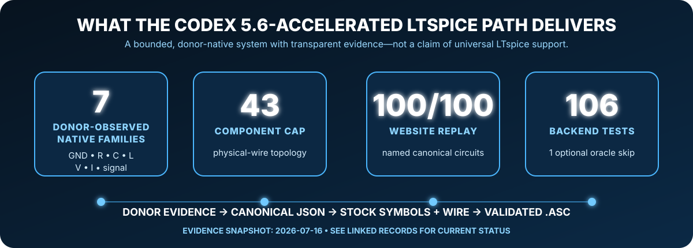

# ProGenEDA-Memory

## Proteus

ProGenEDA-Memory is an evidence-driven native Proteus circuit generator. It
turns a structured circuit request into a `.pdsprj` project by selecting
complete donor-native component packets, arranging them, adding supported
grid-attached terminals and short pin wires, editing safe values, and
validating the resulting project in Proteus.

The current Proteus implementation is in [`proteus/active`](proteus/active).
Its portable application is
[`proteus/active/release/ProgenProteus.exe`](proteus/active/release/ProgenProteus.exe).

### GPT-5.6 implementation phase

GPT-5.6 built the current operational Proteus system: it repaired and
stabilized the component placer, consolidated terminal placement into one
shared route, implemented grid-attached short-wire terminal behavior, added
the value/properties editor, built the portable executable, and organized the
runtime donors, catalogue, validation, and documentation into the active
backend.

It also directed automated analysis and local Proteus open/save/cold-reopen
checks. That replaced the earlier workflow where every generated circuit had
to be opened and checked manually, making large regression and scale testing
practical.

For the detailed record, see
[`proteus/active/GPT_5_6_PROGRESS.md`](proteus/active/GPT_5_6_PROGRESS.md).

### Current pipeline

```text
Circuit JSON / CircuitIR
  -> input and catalogue validation
  -> donor-backed component placement
  -> arrangement and coordinate beautification
  -> shared catalogue-driven terminal placement
  -> optional value/properties editing
  -> binary validation and local Proteus acceptance gate
  -> native .pdsprj output
```

The component placer is deliberately replaceable. Downstream stages consume a
placed-design contract—component identity, complete native packet, bounds and
pin descriptors—rather than depending on a fixed mega-donor slot or template
coordinate.

### Use the latest executable

`ProgenProteus.exe` is rebuilt from the active source and includes its locked
runtime donor closure. From the repository root:

```powershell
.\proteus\active\release\ProgenProteus.exe generate `
  .\proteus\active\examples\progen_proteus_r_c_value_edit.json `
  --output .\out\r_c_terminalized.pdsprj
```

Other commands:

```powershell
.\proteus\active\release\ProgenProteus.exe --help
.\proteus\active\release\ProgenProteus.exe inspect .\out\r_c_terminalized.pdsprj
.\proteus\active\release\ProgenProteus.exe edit-values <input.pdsprj> --edits <values.json> --output <output.pdsprj>
```

The executable uses the same pipeline as the Python interface. Its build and
smoke-test record is in
[`proteus/active/release/README.md`](proteus/active/release/README.md).

### Use the Python pipeline directly

No executable is required. Set the active source root, then use the same CLI
entry point:

```powershell
$env:PYTHONPATH = "proteus/active/src"
python -m proteusgen.proteus_cli generate `
  proteus/active/examples/progen_proteus_r_c_value_edit.json `
  --output out/r_c_terminalized.pdsprj
```

When installed from the checkout, the equivalent public command is:

```powershell
progen-proteus generate proteus/active/examples/progen_proteus_r_c_value_edit.json --output out/r_c_terminalized.pdsprj
```

Python callers can build a request and invoke the application directly:

```python
import json
from pathlib import Path
from proteusgen.proteus_app import generate_proteus_project

payload = json.loads(
    Path("proteus/active/examples/progen_proteus_r_c_value_edit.json").read_text(
        encoding="utf-8"
    )
)
result = generate_proteus_project(
    payload,
    Path("out/r_c_terminalized.pdsprj"),
)
print(result.output)
```

The input schema, examples, catalogue, and supported property syntax are in
[`proteus/active/schemas`](proteus/active/schemas),
[`proteus/active/examples`](proteus/active/examples), and
[`proteus/active/knowledge/component_catalog_v0.json`](proteus/active/knowledge/component_catalog_v0.json).

### Current component support in the latest executable

The locked mega donor supports bare placement of **56 component families**:

| Group | Families |
| --- | --- |
| Passives and discrete (24) | `RESISTOR`, `CAP`, `CAP-ELEC`, `REALIND`, `DIODE`, `1N4007`, `1N4148`, `1N4733A`, `1N6000B`, `40EPS08`, `BZX55C5V1`, `BZX79C5V1`, `BZY88C`, `LED-RED`, `BRIDGE`, `FUSE`, `NPN`, `PNP`, `2N3904`, `2N4401`, `NMOSFET`, `2N7000`, `BS170`, `TRAN-2P2S` |
| Analog, timing, controls (6) | `LM317T`, `LM741`, `OPAMP`, `NE555`, `POT-HG`, `SWITCH` |
| Sources (4) | `VSOURCE`, `CSOURCE`, `VPULSE`, `VSINE` |
| Displays (2) | `7SEG-COM-AN-BLUE` (`7SEGCOMA`), `7SEG-COM-CAT-BLUE` (`7SEGCOMK`) |
| IC packages (20) | `4027`, `4511`, `7447`, `7490`, `74HC00`, `74HC02`, `74HC04`, `74HC08`, `74HC151`, `74HC157`, `74HC160`, `74HC174`, `74HC192`, `74HC266`, `74HC283`, `74HC32`, `74HC74`, `74HC76`, `74HC85`, `74HC86` |

Default terminalized executable generation is currently promoted for these
**18 two-pin families**:

`RESISTOR`, `CAP`, `CAP-ELEC`, `REALIND`, `DIODE`, `1N4007`, `1N4148`,
`1N4733A`, `1N6000B`, `40EPS08`, `BZX55C5V1`, `BZX79C5V1`, `BZY88C`,
`LED-RED`, `VSOURCE`, `CSOURCE`, `VSINE`, and `VPULSE`.

All other placement-supported families can be deliberately emitted without
terminals using `--no-terminals`. `FUSE` and `SWITCH` are explicitly blocked
from the combined terminal route. Multi-pin terminal and arbitrary-net wiring
are not promoted as general executable features yet; the generator rejects
unsafe requests instead of silently inventing Proteus binary records.

### Repository structure

```text
proteus/
  active/          current package, executable, tests, docs, schemas, catalogue,
                   fixtures, runtime donor closure, and operational evidence
  experiments/     dated trials, generated packs, runner scripts, imports, reports
  archive/         retained historical donors, backups, legacy entry points, docs
```

The generated hash-backed map is
[`proteus/active/REPOSITORY_MAP.md`](proteus/active/REPOSITORY_MAP.md). It
links to the complete inventory, active manifest, ignored-local-items record,
and archive indexes.

### Verify a generated project locally

Run the normal Proteus loader gate on a disposable copy:

```powershell
powershell -ExecutionPolicy Bypass -File proteus/active/tools/invoke_local_proteus_gate.ps1 `
  -Project out/r_c_terminalized.pdsprj
```

This cold-opens the project, waits for the schematic to stabilize, checks for
loader dialogs, cold-reopens it, and records whether Proteus changed the copy.
For implementation details, current limitations, tests, and experiment
evidence, start at [`proteus/active/README.md`](proteus/active/README.md).

---

## KiCad

ProGenEDA-Memory includes a source-backed KiCad generator that turns the
shared canonical circuit JSON into an editable `.kicad_pro` project, a real
`.kicad_sch`, and, when every physical constraint is satisfied, an accepted
two-layer `.kicad_pcb`. The active implementation is in [`kicad/`](kicad/),
with the current release status in
[`kicad/FINALIZATION_STATUS.md`](kicad/FINALIZATION_STATUS.md).

### Codex 5.6 implementation phase

> **CODEX 5.6-ACCELERATED KICAD DELIVERY**
>
> Codex 5.6 transformed the earlier KiCad placement experiments into the
> current end-to-end backend: tolerant main-JSON repair, source-backed symbol
> and pin resolution, placement, arrangement selection, coordinate
> beautification, wire/terminal/combination routing, real KiCad schematic and
> PCB writing, value editing, hosted expected-net validation, native PCB
> validation, artifact packaging, and a portable executable.

The change from the 5.5-era experimental work to the Codex 5.6 phase is a
decisive engineering jump. 5.6 made the stages independent but executable as
one pipeline, retained alternate layout/routing evidence instead of overwriting
it, added deterministic repair and validation gates, and pushed the backend
through large real JSON corpora rather than relying on guided hand-made demos.
It also built the 400-circuit qualification corpus, repaired the discovered
multi-unit pin/body-clearance defect in the shared generator, rebuilt the
portable release, and independently checked the repaired output with KiCad
10.0.4 netlist export and PCB DRC.

### Current pipeline

```text
Canonical Circuit JSON
  -> deterministic input fixer + validator
  -> source-backed component placement + validation
  -> arrangement decider + coordinate beautifier
  -> wire planner / terminal placer / combination policy
  -> native KiCad schematic writer + value editor
  -> expected-net, geometry, clearance, and final validators
  -> optional bounded two-layer PCB compiler, router, and validator
  -> user project archive + optional direct PCB + internal audit bundle
```

`combination` is the production default: ordinary local nets are wired while
power, high-fanout, and bounded-route fallback nets use explicit KiCad terminal
objects. Strict wire mode remains available and fails visibly rather than
silently substituting terminals.

### Use the latest executable

The verified portable release is
[`progen-kicad-portable-2026_07_17_kq26_clearance_v1.zip`](kicad/release/progen-kicad-portable-2026_07_17_kq26_clearance_v1.zip).

```bash
unzip kicad/release/progen-kicad-portable-2026_07_17_kq26_clearance_v1.zip
./progen-kicad-portable/progen-kicad run INPUT.json \
  --output-root /tmp/progen-kicad-runs \
  --routing-mode combination
```

For PCB-only output from the same canonical input:

```bash
./progen-kicad-portable/progen-kicad run-pcb INPUT.json \
  --output-root /tmp/progen-kicad-pcb-runs \
  --routing-mode combination
```

### Use the Python pipeline directly

The executable is a wrapper around the committed source; development and
server-side generation can run the exact same pipeline without packaging:

```bash
PYTHONPATH=. python -m kicad.pipeline.progen_kicad_executable run INPUT.json \
  --output-root /tmp/progen-kicad-runs \
  --routing-mode combination
```

Run reproducible layout variants with:

```bash
PYTHONPATH=. python -m kicad.pipeline.progen_kicad_executable run-variations \
  kicad/qualification/corpora/2026_07_17_common_400_v2/final_json \
  --output-root /tmp/progen-kicad-variations \
  --routing-mode combination --sample-count 100 --variations-per-circuit 3
```

### Current evidence and scope

The current 400-circuit qualification corpus contains 17,890 component
instances, 13,490 expected nets, 116 supported KiCad component words, and a
maximum of 89 components in one circuit. The immutable 390-project base plus
the separately regenerated ten-project clearance supplement are all clean;
the supplement also passed KiCad 10.0.4 netlist export and PCB DRC. The
qualification record is in
[`kicad/qualification/RESULTS_2026_07_17.md`](kicad/qualification/RESULTS_2026_07_17.md).

PCB output is intentionally bounded: only projects with resolved source
footprints/pads and a passing physical validator receive a board. The
qualification batch accepted 311 PCB outputs; the remaining 89 schematic
projects retained a documented PCB withholding rather than shipping a dubious
board. See [`kicad/pcb/README.md`](kicad/pcb/README.md) for the exact physical
contract.

### Repository structure

```text
kicad/
  pipeline/        active JSON, placement, routing, validation, and packaging stages
  pcb/             source-backed physical compiler, router, parser, and validator
  qualification/   locked corpus, repeatable runner, and immutable results
  source_pack/     KiCad source references used by no-installation validation
  release/         portable executable and website handoff artifacts
  examples/        immutable generated evidence runs
```

---

## EasyEDA Pro

The independent EasyEDA Pro backend turns the same canonical JSON into one
native `.eprj` SQLite project. It copies exact authorized source records for
each locked symbol, device, footprint, pad, power terminal, and net port; it
does not invent visual stand-ins. The implementation lives in
[`Easyeda/`](Easyeda/).

### Codex 5.6 implementation phase

> **CODEX 5.6 BUILT THE EASYEDA BACKEND END TO END**
>
> Codex 5.6 single-handedly took the supplied EasyEDA Pro desktop/source
> package from a compatibility-research target to an operational native
> generator. It installed and stabilized EasyEDA Pro in this environment,
> learned the real SQLite project grammar and donor records, built the locked
> catalogue, exact donor resolver, deterministic JSON fixer, compact schematic
> router, terminal logic, PCB compiler/router, native validators, portable
> executable, website handoff, JSON editor contract, and 300-circuit
> qualification system.

The advantage over the previous 5.5-era starting point is stark: 5.6 replaced
small exploratory conversion attempts with a complete donor-native automation
loop. It generated native projects, opened disposable copies in EasyEDA Pro,
held complex schematics open for visual review, captured the relevant visual
evidence during development, verified the originals were not rewritten, and
used those results to tighten compact-routing and no-overlapping-wire-span
rules. That is the difference between a file emitter and a hardened backend.

### Current pipeline

```text
Canonical Circuit JSON
  -> deterministic input repair + exact donor/pin resolution
  -> square-like placement + compact wire/terminal/combination planning
  -> native schematic records + optional bounded two-layer PCB records
  -> native SQLite .eprj writer
  -> independent source, pin, net, geometry, and PCB validation
  -> .eprj project + internal audit ZIP
  -> installed EasyEDA Pro open/visual acceptance for release evidence
```

### Use the latest executable

```bash
Easyeda/dist/progen-easyeda run INPUT.json \
  --output-root /tmp/progen-easyeda-runs \
  --routing-mode combination --events ndjson
```

The release and website handoff details are in
[`Easyeda/README.md`](Easyeda/README.md) and
[`Easyeda/release/newwebsite_easyeda_handoff_2026_07_17/`](Easyeda/release/newwebsite_easyeda_handoff_2026_07_17/).

### Use the Python pipeline directly

No executable is required from a source checkout:

```bash
PYTHONPATH=. python -m Easyeda.executable run INPUT.json \
  --output-root /tmp/progen-easyeda-runs \
  --routing-mode combination --events ndjson
```

Deterministic input repair, validation, and editable-field discovery use the
same source entry point:

```bash
PYTHONPATH=. python -m Easyeda.executable validate-input INPUT.json
PYTHONPATH=. python -m Easyeda.executable fix-input INPUT.json --output fixed.json
PYTHONPATH=. python -m Easyeda.executable editable INPUT.json
```

### Current evidence and scope

The locked EasyEDA catalogue provides 59 logical entries backed by 57 physical
source families plus native `GND` and `VCC` terminal families. It accepts up to
80 schematic components and emits a PCB only when its 32-physical-component
profile has exact footprint/pad mappings and passes physical validation.

Codex 5.6 drove the complete 300-circuit named corpus through the untouched
portable pipeline: 300/300 exact native-netlist, full-pin, source-hash,
geometry, and PCB-ready passes. The ten most complex projects were opened in
the installed EasyEDA Pro application and visually inspected. Full evidence is
in [`Easyeda/qualification/RESULTS_2026_07_17.md`](Easyeda/qualification/RESULTS_2026_07_17.md).

### Repository structure

```text
Easyeda/
  donor_source.py, catalogue.py  exact locked source-record authority
  geometry.py, pcb.py            placement, compact routing, and physical board stages
  native.py, validator.py        SQLite emission and independent native validation
  executable.py                  direct source CLI behind the portable executable
  qualification/                 locked 300-circuit corpus and repeatable evidence
  release/                       portable/website handoff artifacts
```

---

## LTspice


ProGenEDA-Memory also contains an evidence-driven, donor-native LTspice
generator. It turns the same canonical circuit JSON used by the KiCad path
into a real `.asc` schematic using installed LTspice stock symbols, approved
native properties, and direct physical `WIRE` records. The active implementation
is in [`ltspice/`](ltspice/); its portable Linux build source is in
[`ltspice/packaging/`](ltspice/packaging/).

The goal is not a generic SPICE exporter. The native path learns from real
LTspice donor files, records symbol/pin/property facts in its catalogue, places
and beautifies the stock symbols, routes every net physically, writes the ASC,
then performs deterministic validation before releasing an artifact.

### ⚡ Codex 5.6 implementation phase

> **CODEX 5.6-ACCELERATED, MAINTAINER-DIRECTED ENGINEERING**
>
> The maintainer credits **Codex 5.6** for converting the detailed donor-first
> brief into the operational LTspice backend: donor parser, native catalogue,
> stock-symbol placer, safe property boundary, physical-wire router,
> beautifier, ASC writer/parser/validators, timing release gate, portable
> executable, website adapter, JSON Lab, and named regression corpus.

This is intentionally a project credit rather than a claim that a model worked
without human direction. The maintainer supplied the architecture, donor corpus,
and acceptance criteria; Codex performed the implementation and validation in
two principal delivery phases, with later review and repair passes. The result
is a concrete example of **Codex 5.6** accelerating a substantial engineering
workflow while preserving evidence, limits, and deterministic checks.



The animated pulse groups the real executable stage contract. It never claims
a download before the `package_artifacts` stage succeeds. If a renderer does
not animate SVG—or a visitor prefers reduced motion—the labelled static flow
remains the fallback diagram.

| Readable flow group | Real executor stages |
| --- | --- |
| Canonicalize | `canonicalize_input` |
| Resolve | `resolve_donor_catalogue` |
| Place + beautify | `place_stock_symbols`, `beautify_layout` |
| Route + write | `route_physical_wires`, `write_native_asc` |
| Validate + package | `validate_native_asc`, `package_artifacts` |

### Current pipeline

```text
Shared canonical Circuit JSON
  -> canonical + catalogue validation
  -> donor-backed stock-symbol placement
  -> deterministic coordinate beautification
  -> physical direct-WIRE routing
  -> native ASC emission
  -> ASC / topology / safety validation
  -> package only after the release gate
  -> validated .asc artifact
```

The stages are emitted as real NDJSON events:
`canonicalize_input`, `resolve_donor_catalogue`, `place_stock_symbols`,
`beautify_layout`, `route_physical_wires`, `write_native_asc`,
`validate_native_asc`, and `package_artifacts`. With an explicit animation
budget, the executable reports “taking longer than expected” at 1× and only
fails/retracts the download at 2×.

### Use the latest executable

Build the host-native Linux executable from the repository root:

```bash
nix shell nixpkgs#python313Packages.pyinstaller \
  -c bash ltspice/packaging/build_linux.sh
```

Then generate a donor-native project:

```bash
./dist/progen-ltspice-linux-x86_64/progen-ltspice \
  ltspice/examples/native_observed_family_mix.json \
  --outdir /tmp/progen-ltspice-output \
  --label native-smoke
```

The resulting `.asc` is a normal LTspice schematic. The executable bundles the
generator/catalogues needed for deterministic creation; it intentionally does
**not** bundle LTspice, Wine, or proprietary LTspice libraries. See
[`ltspice/packaging/README.md`](ltspice/packaging/README.md) for build/runtime
details.

### Use the Python pipeline directly

No executable is required while developing from this checkout:

```bash
PYTHONPATH=. python -m ltspice \
  ltspice/examples/native_observed_family_mix.json \
  --outdir /tmp/progen-ltspice-output \
  --label native-smoke \
  --engine donor_native
```

For live stage information and the requested download-release policy:

```bash
PYTHONPATH=. python -m ltspice INPUT.json \
  --outdir /tmp/progen-ltspice-output \
  --label animated-run \
  --events ndjson \
  --animation-budget-seconds 20
```

The detailed internal contract is in
[`ltspice/ARCHITECTURE.md`](ltspice/ARCHITECTURE.md); the machine-readable
source of truth is
[`ltspice/catalogues/ltspice_main_catalogue.json`](ltspice/catalogues/ltspice_main_catalogue.json).

### Current donor-observed capability boundary

The active donor-native capability boundary is deliberately bounded. It accepts
up to **43 logical components** per circuit, including logical grounds, and
routes only with physical wires—never named-terminal or custom-symbol fallbacks.
`donor_observed` records real donor and catalogue evidence; the remaining
per-family GUI/count/property promotion gaps remain explicitly tracked.

| Native family | Guided editable scope |
| --- | --- |
| Ground | Physical ground anchor only |
| Resistor | Reference, value, tolerance, power rating |
| Capacitor | Reference, value |
| Inductor | Reference, value, peak current, series/parallel R and C |
| Voltage source | Reference, DC/AC value, approved waveform, series/parallel fields, display windows |
| Current source | Reference, DC/AC value, approved waveform, load/display fields |
| `Misc\\signal` | Reference, validated source expression, AC/display fields |

Unsupported symbols, unapproved attributes, incomplete nets, foreign-pin
contacts, and label/terminal routing modes are rejected deterministically
rather than approximated. This is not a claim of universal LTspice support.
The exact capability/evidence boundary and next donor requests are tracked in
[`ltspice/docs/SUPPORT_GAPS.md`](ltspice/docs/SUPPORT_GAPS.md).

### Evidence, common circuits, and the Codex 5.6 delivery record



The ordinary generator produced a named **100-circuit** R/C/L/source corpus,
with each folder holding canonical input, generated ASC, and accuracy check.
The website-level replay accepted **100/100** corpus inputs. The native Python
suite has **106 passing tests** with one optional installed-oracle test skipped
by default. The visual evidence below is deliberately paired with the scope
limits above: it celebrates the **Codex 5.6**-credited delivery without
inventing support or simulation claims.

- [`ltspice/docs/COMMON_CIRCUIT_CORPUS.md`](ltspice/docs/COMMON_CIRCUIT_CORPUS.md)
- [`ltspice/docs/COMMON_CIRCUIT_BUNDLE.md`](ltspice/docs/COMMON_CIRCUIT_BUNDLE.md)
- [`ltspice/docs/COMMON_CIRCUIT_GUI_REVIEW.md`](ltspice/docs/COMMON_CIRCUIT_GUI_REVIEW.md)
- [`ltspice/docs/NATIVE_GUI_VERIFICATION.md`](ltspice/docs/NATIVE_GUI_VERIFICATION.md)
- [`ltspice/docs/SOURCE_PROPERTY_RESEARCH.md`](ltspice/docs/SOURCE_PROPERTY_RESEARCH.md)

### Repository structure

```text
ltspice/
  catalogues/       permanent donor-native component/property/pin authority
  pipeline/         learner, placer, wire router, beautifier, writer, validators
  packaging/        reproducible portable-executable entry point and build script
  examples/         canonical inputs and ignored local generated evidence
  tests/            native, timing, routing, corpus, and safety regression tests
  docs/             architecture, support gaps, GUI/properties/corpus evidence
  ARCHITECTURE.md    full internal design and completion criteria
  README.md          detailed LTspice implementation guide
```

### Verify a generated schematic locally

Run the deterministic suite:

```bash
PYTHONPATH=. python -m unittest discover -s ltspice/tests -v
```

For a real desktop/open-and-screenshot evidence run, use the guarded verifier
against a disposable generated ASC:

```bash
PYTHONPATH=. python -m ltspice.pipeline.native_gui_verifier GENERATED.asc \
  --screenshot /tmp/ltspice-check.png \
  --evidence /tmp/ltspice-check.json
```

The verifier checks the native-output boundary, opens the file through the
registered desktop association, captures the LTspice window, and writes a
review checklist. It never silently promotes an unreviewed component family.
For the full story, begin with [`ltspice/README.md`](ltspice/README.md) and
[`ltspice/ARCHITECTURE.md`](ltspice/ARCHITECTURE.md).
